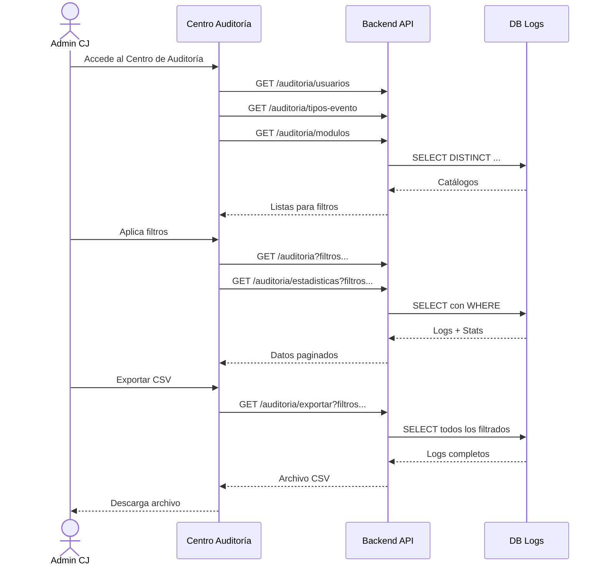

# HU-CJ-003: Revisión de Registros de Actividad

## Información General

| Campo | Valor |
|-------|-------|
| **Código** | HU-CJ-003 |
| **Nombre** | Revisión de Registros de Actividad |
| **Sprint** | Sprint 4 |
| **Actor Principal** | Administrador del Consejo de la Judicatura (ADMIN_CJ) |
| **Estado** | ✅ Completado |
| **Fecha de Implementación** | Enero 2026 |

---

## Descripción

Como **Administrador del Consejo de la Judicatura**, necesito revisar los registros de actividad del sistema para auditar las acciones realizadas por los usuarios, detectar anomalías de seguridad y garantizar el cumplimiento de las políticas de uso del sistema judicial.

---

## Criterios de Aceptación

### CA-001: Acceso Restringido
- [x] Solo usuarios con rol `ADMIN_CJ` pueden acceder al Centro de Auditoría
- [x] El acceso requiere autenticación válida con certificado digital
- [x] Intentos de acceso no autorizados son registrados

### CA-002: Visualización de Logs
- [x] Los logs se muestran en formato tabular con paginación
- [x] Cada registro muestra: fecha, usuario, acción, módulo, IP y resultado
- [x] Vista responsive: tabla en desktop, tarjetas en móvil

### CA-003: Filtros y Búsqueda
- [x] Filtro por rango de fechas (desde/hasta)
- [x] Filtro por usuario (lista de usuarios con actividad)
- [x] Filtro por tipo de evento
- [x] Filtro por módulo afectado
- [x] Filtro por resultado (exitoso/error/denegado)
- [x] Búsqueda de texto libre en todos los campos

### CA-004: Estadísticas Globales
- [x] Contador de registros totales
- [x] Contador de operaciones exitosas
- [x] Contador de errores
- [x] Contador de accesos denegados
- [x] Las estadísticas reflejan el total filtrado, no solo la página actual

### CA-005: Exportación
- [x] Exportar logs filtrados en formato CSV
- [x] El archivo incluye todos los campos relevantes
- [x] Nombre del archivo incluye fecha de exportación

### CA-006: Integridad de Cadena (Hash Chaining)
- [x] Cada registro tiene un hash SHA-256 del registro anterior
- [x] Endpoint para verificar la integridad de la cadena
- [x] Detección de registros alterados o eliminados

---

## Arquitectura Técnica

### Base de Datos

**Contenedor:** `juez_seguro_db_logs`  
**Base de datos:** `db_logs`  
**Usuario:** `admin_logs`

#### Tabla: `logs_auditoria`

```sql
CREATE TABLE logs_auditoria (
    log_id SERIAL PRIMARY KEY,
    usuario_id INTEGER,
    usuario_correo VARCHAR(255),
    tipo_evento VARCHAR(100) NOT NULL,
    modulo_afectado VARCHAR(100),
    descripcion_evento TEXT,
    ip_origen VARCHAR(45),
    user_agent TEXT,
    fecha_evento TIMESTAMP WITH TIME ZONE DEFAULT CURRENT_TIMESTAMP,
    datos_adicionales JSONB,
    hash_registro CHAR(64) NOT NULL,
    hash_anterior CHAR(64),
    causa_referencia VARCHAR(50)
);
```

#### Índices para Optimización

```sql
CREATE INDEX idx_logs_fecha ON logs_auditoria(fecha_evento DESC);
CREATE INDEX idx_logs_usuario ON logs_auditoria(usuario_correo);
CREATE INDEX idx_logs_tipo ON logs_auditoria(tipo_evento);
CREATE INDEX idx_logs_modulo ON logs_auditoria(modulo_afectado);
CREATE INDEX idx_logs_hash_anterior ON logs_auditoria(hash_anterior);
```

### Backend

**Ruta base:** `/api/auditoria`

#### Endpoints Implementados

| Método | Ruta | Descripción |
|--------|------|-------------|
| GET | `/` | Obtener logs con filtros y paginación |
| GET | `/:id` | Obtener un log específico por ID |
| GET | `/estadisticas` | Obtener estadísticas globales |
| GET | `/tipos-evento` | Listar tipos de evento únicos |
| GET | `/modulos` | Listar módulos únicos |
| GET | `/usuarios` | Listar usuarios con actividad |
| GET | `/exportar` | Exportar logs en CSV |
| GET | `/verificar-cadena` | Verificar integridad hash chain |

#### Servicio de Auditoría

**Archivo:** `backend/src/services/audit.service.ts`

```typescript
class AuditService {
  // Registro de eventos con hash chaining
  async logEvent(evento: EventoAuditoria): Promise<void>
  
  // Consulta de logs con filtros
  async getLogs(filtros: FiltrosAuditoria): Promise<PaginatedResponse>
  
  // Estadísticas globales
  async getEstadisticas(filtros: FiltrosEstadisticas): Promise<Estadisticas>
  
  // Verificación de integridad
  async verificarCadenaIntegridad(): Promise<ResultadoVerificacion>
  
  // Catálogos
  async getTiposEvento(): Promise<string[]>
  async getModulos(): Promise<string[]>
  async getUsuariosEnLogs(): Promise<string[]>
  
  // Exportación
  async exportarCSV(filtros: FiltrosAuditoria): Promise<string>
}
```

#### Algoritmo de Hash Chaining

```typescript
// Generación del hash del registro
const contenidoHash = [
  log_id,
  usuario_id,
  tipo_evento,
  modulo_afectado,
  descripcion_evento,
  ip_origen,
  fecha_evento.toISOString(),
  hash_anterior || 'GENESIS'
].join('|');

const hash_registro = crypto
  .createHash('sha256')
  .update(contenidoHash)
  .digest('hex');
```

### Frontend

**Componente Principal:** `frontend/src/pages/funcionarios/CentroAuditoria.tsx`

#### Características de UI

1. **Header con Estadísticas**
   - 4 tarjetas: Total, Exitosas, Errores, Denegadas
   - Valores globales (no por página)
   - Iconos con colores semánticos

2. **Panel de Filtros**
   - Rango de fechas con calendario
   - Dropdowns para usuario, tipo, módulo, resultado
   - Búsqueda de texto libre
   - Botón de limpiar filtros

3. **Controles de Paginación**
   - Selector de registros por página (10, 25, 50, 100)
   - Navegación: primera, anterior, siguiente, última
   - Indicador de página actual y total

4. **Tabla/Tarjetas de Logs**
   - Vista tabla en pantallas grandes (≥768px)
   - Vista tarjetas en móviles
   - Filas expandibles para ver detalles
   - Badges de resultado con colores

5. **Acciones**
   - Refrescar datos
   - Exportar a CSV
   - Verificar integridad de cadena

#### Servicio Frontend

**Archivo:** `frontend/src/services/auditoria.service.ts`

```typescript
const auditoriaService = {
  getLogs(filtros): Promise<PaginatedResponse<LogAuditoria>>
  getLogById(id): Promise<LogAuditoria>
  getEstadisticasGlobales(filtros): Promise<Estadisticas>
  getTiposEvento(): Promise<string[]>
  getModulos(): Promise<string[]>
  getUsuariosEnLogs(): Promise<string[]>
  exportarLogs(filtros): Promise<Blob>
  verificarCadena(): Promise<ResultadoVerificacion>
}
```

---

## Tipos de Eventos Registrados

| Categoría | Eventos |
|-----------|---------|
| **Autenticación** | LOGIN_EXITOSO, LOGIN_FALLIDO, LOGOUT, SESION_EXPIRADA |
| **Causas** | CAUSA_CREADA, CAUSA_CONSULTADA, CAUSA_MODIFICADA |
| **Documentos** | DOCUMENTO_SUBIDO, DOCUMENTO_DESCARGADO, DOCUMENTO_FIRMADO |
| **Audiencias** | AUDIENCIA_PROGRAMADA, AUDIENCIA_MODIFICADA, AUDIENCIA_CANCELADA |
| **Acceso** | ACCESO_DENEGADO, PERMISO_RECHAZADO |
| **Sistema** | ERROR_SISTEMA, OPERACION_FALLIDA |

---

## Seguridad

### Control de Acceso
- Autenticación requerida vía middleware `authenticate`
- Autorización por rol con middleware `authorize("ADMIN_CJ")`
- Todas las operaciones se registran en el mismo log

### Integridad de Datos
- Hash SHA-256 por registro
- Encadenamiento de hashes (hash_anterior)
- Verificación de cadena disponible

### Privacidad
- IPs registradas para trazabilidad
- User-Agent capturado
- Datos sensibles pueden estar en `datos_adicionales` (JSONB)

---

## Flujo de Uso



---

## Archivos Modificados/Creados

### Backend
- `backend/src/services/audit.service.ts` - Servicio de auditoría
- `backend/src/routes/auditoria.routes.ts` - Endpoints REST
- `backend/src/middleware/auth.ts` - Middleware de autenticación

### Frontend
- `frontend/src/pages/funcionarios/CentroAuditoria.tsx` - Componente principal
- `frontend/src/services/auditoria.service.ts` - Servicio de API

### Base de Datos
- `scripts/logs/05_mejoras_hu_cj_003.sql` - Migración para hash chaining

---

## Pruebas

### Escenarios de Prueba

1. **Acceso con rol correcto**
   - Login como `admin.cj@judicatura.gob.ec`
   - Verificar acceso al Centro de Auditoría ✅

2. **Acceso denegado**
   - Login como juez o secretario
   - Verificar redirección o error 403 ✅

3. **Filtros funcionan**
   - Aplicar filtro de fecha
   - Aplicar filtro de usuario
   - Verificar que los resultados coinciden ✅

4. **Estadísticas correctas**
   - Comparar conteo manual vs estadísticas
   - Verificar que son globales, no por página ✅

5. **Exportación CSV**
   - Exportar con filtros
   - Verificar contenido del archivo ✅

6. **Integridad de cadena**
   - Ejecutar verificación
   - Confirmar que no hay roturas ✅

---

## Notas de Implementación

### Paginación del Lado del Servidor
La paginación se realiza en el backend para evitar cargar miles de registros en el cliente. El frontend solicita una página específica con un tamaño configurable.

### Estadísticas Globales
Las estadísticas se calculan con una consulta separada que cuenta todos los registros que coinciden con los filtros, no solo los de la página actual. Esto proporciona una visión precisa del estado general de la auditoría.

### Responsive Design
El componente detecta el tamaño de pantalla y muestra:
- **Desktop (≥768px):** Tabla con columnas completas
- **Móvil (<768px):** Tarjetas apiladas con información condensada

### Hash Chaining
Cada nuevo registro de auditoría incluye el hash del registro anterior, creando una cadena inmutable. Si alguien modifica o elimina un registro, la verificación de cadena detectará la inconsistencia.

---

## Conclusión

La HU-CJ-003 proporciona al Consejo de la Judicatura una herramienta completa para auditar las actividades del sistema judicial. Con filtros avanzados, estadísticas en tiempo real, exportación de datos y verificación de integridad, los administradores pueden mantener un control efectivo sobre el uso del sistema y detectar cualquier anomalía de seguridad.
