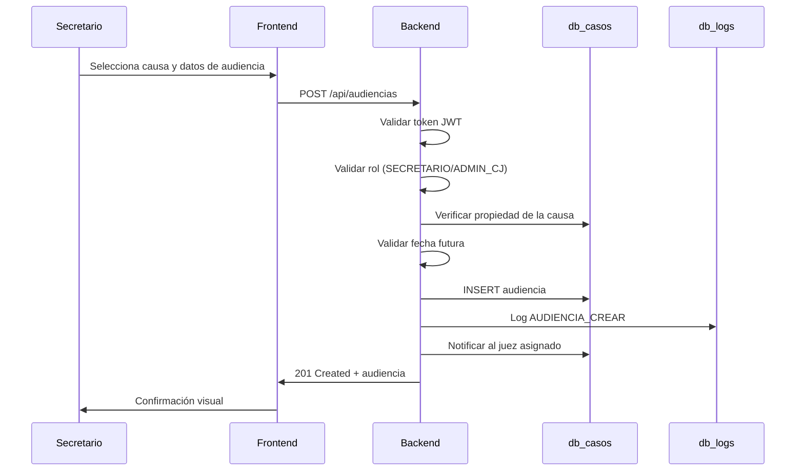
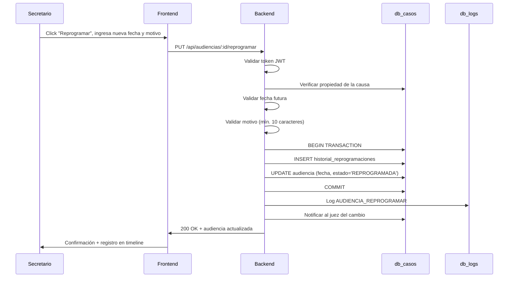

# HU-SJ-003: Gestión de Audiencias con Trazabilidad

## 📋 Información General

| Campo | Valor |
|-------|-------|
| **ID** | HU-SJ-003 |
| **Nombre** | Gestión de Audiencias con Trazabilidad Completa |
| **Módulo** | Gestión de Audiencias |
| **Sprint** | Sprint 2 |
| **Estado** | ✅ Implementado |
| **Prioridad** | 🔴 CRÍTICA |
| **Fecha Implementación** | 2026-01-06 |

## 🎯 Objetivo

Permitir a los **Secretarios Judiciales** programar, reprogramar y gestionar audiencias judiciales con un sistema de **trazabilidad completa** que registre todos los cambios, incluyendo historial de reprogramaciones con motivos documentados.

## 📖 Historia de Usuario

**Como** Secretario Judicial  
**Quiero** programar y reprogramar audiencias para las causas que gestiono  
**Para** coordinar las actividades judiciales y mantener un registro auditable de todos los cambios

## 🔐 Requisitos de Seguridad

### 1. Control de Acceso por Rol (FDP_ACC)

#### Roles y Permisos

| Rol | Programar | Reprogramar | Ver | Cambiar Estado |
|-----|-----------|-------------|-----|----------------|
| **SECRETARIO** | ✅ (solo sus causas) | ✅ (solo sus causas) | ✅ (solo sus causas) | ✅ |
| **JUEZ** | ❌ | ❌ | ✅ (solo sus causas) | ❌ |
| **ADMIN_CJ** | ✅ (todas) | ✅ (todas) | ✅ (todas) | ✅ |

#### Validación de Propiedad
- ✅ Secretario solo gestiona audiencias de causas que él creó
- ✅ Juez solo ve audiencias de causas asignadas a él
- ✅ Verificación de `creado_por_id` en cada operación

**Código de Validación**:
```typescript
// Verificar que el secretario creó la causa
const verificacion = await client.query(
  `SELECT c.causa_id FROM causas c
   JOIN audiencias a ON c.causa_id = a.causa_id
   WHERE a.audiencia_id = $1 AND c.creado_por_id = $2`,
  [audienciaId, secretarioId]
);

if (verificacion.rows.length === 0) {
  throw new ForbiddenError("No tiene permiso para modificar esta audiencia");
}
```

### 2. Validación de Datos de Entrada

#### Esquema de Validación (Zod)
```typescript
const ProgramarAudienciaSchema = z.object({
  causaId: z.number().int().positive(),
  tipo: z.enum(["INICIAL", "CONTINUACION", "SENTENCIA", "APELACION"]),
  fechaHora: z.string().datetime(),      // ISO 8601
  sala: z.string().min(1).max(100),
  duracionMinutos: z.number().int().min(15).max(480).optional(),
  modalidad: z.enum(["PRESENCIAL", "VIRTUAL", "HIBRIDA"]),
  observaciones: z.string().max(1000).optional(),
});

const ReprogramarAudienciaSchema = z.object({
  nuevaFecha: z.string().datetime(),
  motivo: z.string().min(10).max(500),  // Motivo obligatorio
});
```

#### Validaciones de Negocio
- ✅ La fecha de audiencia debe ser **futura**
- ✅ El motivo de reprogramación es **obligatorio** (mín. 10 caracteres)
- ✅ No se puede reprogramar una audiencia ya realizada o cancelada

### 3. Trazabilidad de Reprogramaciones (FAU_GEN)

#### Historial de Reprogramaciones
Cada reprogramación genera un registro inmutable con:

| Campo | Descripción |
|-------|-------------|
| `historial_id` | ID único del registro |
| `audiencia_id` | Audiencia afectada |
| `fecha_hora_anterior` | Fecha/hora antes del cambio |
| `fecha_hora_nueva` | Nueva fecha/hora programada |
| `sala_anterior` | Sala antes del cambio |
| `sala_nueva` | Nueva sala asignada |
| `motivo_reprogramacion` | Motivo documentado (obligatorio) |
| `modificado_por_secretario_id` | Quién realizó el cambio |
| `modificado_por_rol` | Rol del usuario |
| `fecha_modificacion` | Timestamp del cambio (UTC) |
| `ip_modificacion` | IP origen de la solicitud |

#### Estructura de la Tabla
```sql
CREATE TABLE audiencias_historial_reprogramaciones (
  historial_id SERIAL PRIMARY KEY,
  audiencia_id INTEGER NOT NULL REFERENCES audiencias(audiencia_id),
  fecha_hora_anterior TIMESTAMPTZ,
  sala_anterior VARCHAR(100),
  fecha_hora_nueva TIMESTAMPTZ,
  sala_nueva VARCHAR(100),
  motivo_reprogramacion TEXT NOT NULL,
  tipo_cambio VARCHAR(50) DEFAULT 'REPROGRAMACION',
  modificado_por_secretario_id INTEGER NOT NULL,
  modificado_por_rol VARCHAR(50) NOT NULL,
  fecha_modificacion TIMESTAMPTZ DEFAULT NOW(),
  ip_modificacion INET,
  estado_anterior VARCHAR(20),
  estado_nuevo VARCHAR(20)
);
```

### 4. Auditoría de Operaciones

Todas las operaciones generan logs en `db_logs`:

| Operación | Tipo Evento | Módulo |
|-----------|-------------|--------|
| Consultar audiencias | `AUDIENCIA_CONSULTAR` | AUDIENCIA |
| Programar audiencia | `AUDIENCIA_CREAR` | AUDIENCIA |
| Reprogramar audiencia | `AUDIENCIA_REPROGRAMAR` | AUDIENCIA |
| Cambiar estado | `AUDIENCIA_CAMBIAR_ESTADO` | AUDIENCIA |

## 🔄 Flujos de Operación

### Flujo 1: Programar Audiencia



### Flujo 2: Reprogramar Audiencia



## 📡 API Endpoints

### POST /api/audiencias
Programa una nueva audiencia.

**Headers**:
```
Authorization: Bearer <jwt_token>
Content-Type: application/json
```

**Request Body**:
```json
{
  "causaId": 9,
  "tipo": "INICIAL",
  "fechaHora": "2026-01-15T10:00:00.000Z",
  "sala": "Sala 2B",
  "duracionMinutos": 60,
  "modalidad": "PRESENCIAL",
  "observaciones": "Primera audiencia del caso"
}
```

**Response 201**:
```json
{
  "success": true,
  "data": {
    "id": 5,
    "causaId": 9,
    "tipo": "INICIAL",
    "fechaHora": "2026-01-15T10:00:00.000Z",
    "sala": "Sala 2B",
    "duracionMinutos": 60,
    "modalidad": "PRESENCIAL",
    "estado": "PROGRAMADA",
    "fechaCreacion": "2026-01-06T04:30:00.000Z"
  },
  "message": "Audiencia programada exitosamente"
}
```

### PUT /api/audiencias/:id/reprogramar
Reprograma una audiencia existente.

**Request Body**:
```json
{
  "nuevaFecha": "2026-01-20T14:00:00.000Z",
  "motivo": "Cambio de agenda por solicitud de las partes procesales"
}
```

**Response 200**:
```json
{
  "success": true,
  "data": {
    "id": 5,
    "causaId": 9,
    "tipo": "INICIAL",
    "fechaHora": "2026-01-20T14:00:00.000Z",
    "estado": "REPROGRAMADA",
    "vecesProgramada": 2
  },
  "message": "Audiencia reprogramada exitosamente"
}
```

### GET /api/causas/:id/historial-reprogramaciones
Obtiene el historial de reprogramaciones de una causa para el timeline.

**Response 200**:
```json
{
  "success": true,
  "data": [
    {
      "historialId": 9,
      "audienciaId": 5,
      "tipoAudiencia": "INICIAL",
      "fechaHoraAnterior": "2026-01-15T10:00:00.000Z",
      "fechaHoraNueva": "2026-01-20T14:00:00.000Z",
      "motivoReprogramacion": "Cambio de agenda por solicitud...",
      "modificadoPorRol": "SECRETARIO",
      "fechaModificacion": "2026-01-06T04:35:00.000Z"
    }
  ]
}
```

## 💻 Implementación Frontend

### Modal Unificado de Programación/Reprogramación

Se implementó un modal con **calendario visual + selector de hora** para mejorar la UX:

```tsx
// Componente: AudienciasModal.tsx
<Dialog open={open} onOpenChange={onOpenChange}>
  <DialogContent className="max-w-lg">
    <DialogHeader>
      <DialogTitle>
        {modoEdicion ? "Reprogramar Audiencia" : "Programar Nueva Audiencia"}
      </DialogTitle>
    </DialogHeader>
    
    {/* Calendario visual */}
    <Calendar
      mode="single"
      selected={selectedDate}
      onSelect={setSelectedDate}
      disabled={(date) => date < new Date()}
    />
    
    {/* Selector de hora */}
    <Input
      type="time"
      value={selectedTime}
      onChange={(e) => setSelectedTime(e.target.value)}
    />
    
    {/* Motivo (solo para reprogramación) */}
    {modoEdicion && (
      <Textarea
        placeholder="Motivo de la reprogramación (mínimo 10 caracteres)"
        value={motivo}
        onChange={(e) => setMotivo(e.target.value)}
        required
        minLength={10}
      />
    )}
  </DialogContent>
</Dialog>
```

### Integración en Timeline del Expediente

Las reprogramaciones aparecen en la línea del tiempo del expediente electrónico:

```tsx
// ExpedienteCausa.tsx - Construcción del timeline
const actuaciones = [
  ...documentos.map(/* ... */),
  ...audiencias.map((aud) => ({
    id: aud.id,
    tipo: "audiencia",
    titulo: `Audiencia de ${aud.tipo} programada`,
    fecha: aud.fechaCreacion,  // Fecha de creación, no fecha programada
    descripcion: `Programada para ${fechaFormateada}`,
  })),
  // Historial de reprogramaciones
  ...historialReprogramaciones.map((rep) => ({
    id: `rep-${rep.historialId}`,
    tipo: "reprogramacion",
    titulo: `🔄 Audiencia reprogramada`,
    fecha: rep.fechaModificacion,
    descripcion: `De: ${fechaAnterior} → A: ${fechaNueva}. Motivo: ${rep.motivoReprogramacion}`,
  })),
].sort((a, b) => new Date(b.fecha).getTime() - new Date(a.fecha).getTime());
```

## 🗃️ Estructura de Base de Datos

### Tabla: audiencias
```sql
CREATE TABLE audiencias (
  audiencia_id SERIAL PRIMARY KEY,
  causa_id INTEGER NOT NULL REFERENCES causas(causa_id),
  tipo VARCHAR(50) NOT NULL,
  fecha_programada TIMESTAMP NOT NULL,
  fecha_hora_programada TIMESTAMPTZ,
  sala VARCHAR(100),
  duracion_minutos INTEGER DEFAULT 60,
  modalidad VARCHAR(20) DEFAULT 'PRESENCIAL',
  observaciones TEXT,
  programado_por_id INTEGER NOT NULL,
  estado VARCHAR(20) DEFAULT 'PROGRAMADA',
  fecha_creacion TIMESTAMPTZ DEFAULT NOW(),
  fecha_actualizacion TIMESTAMPTZ DEFAULT NOW(),
  
  CONSTRAINT chk_tipo CHECK (tipo IN ('INICIAL', 'CONTINUACION', 'SENTENCIA', 'APELACION')),
  CONSTRAINT chk_estado CHECK (estado IN ('PROGRAMADA', 'REPROGRAMADA', 'REALIZADA', 'CANCELADA', 'SUSPENDIDA')),
  CONSTRAINT chk_modalidad CHECK (modalidad IN ('PRESENCIAL', 'VIRTUAL', 'HIBRIDA'))
);
```

### Tabla: audiencias_historial_reprogramaciones
```sql
CREATE TABLE audiencias_historial_reprogramaciones (
  historial_id SERIAL PRIMARY KEY,
  audiencia_id INTEGER NOT NULL REFERENCES audiencias(audiencia_id),
  fecha_hora_anterior TIMESTAMPTZ,
  sala_anterior VARCHAR(100),
  fecha_hora_nueva TIMESTAMPTZ,
  sala_nueva VARCHAR(100),
  motivo_reprogramacion TEXT NOT NULL,
  tipo_cambio VARCHAR(50) DEFAULT 'REPROGRAMACION',
  modificado_por_secretario_id INTEGER NOT NULL,
  modificado_por_rol VARCHAR(50) NOT NULL,
  fecha_modificacion TIMESTAMPTZ DEFAULT NOW(),
  ip_modificacion INET,
  estado_anterior VARCHAR(20),
  estado_nuevo VARCHAR(20)
);
```

## 🔔 Sistema de Notificaciones

Se envían notificaciones automáticas al juez asignado:

| Evento | Notificación |
|--------|--------------|
| Audiencia programada | "Nueva audiencia programada para [fecha]" |
| Audiencia reprogramada | "Audiencia reprogramada de [fecha_ant] a [fecha_nueva]" |

```typescript
// notificaciones.service.ts
await notificacionesService.notificarAudienciaProgramada(
  juezId,
  audienciaId,
  causaId,
  numeroProcesoCompleto,
  fechaHora,
  tipo,
  sala
);
```

## ✅ Criterios de Aceptación

| # | Criterio | Estado |
|---|----------|--------|
| 1 | Secretario puede programar audiencias para sus causas | ✅ |
| 2 | No puede programar audiencias de causas que no creó | ✅ |
| 3 | Fecha de audiencia debe ser futura | ✅ |
| 4 | Reprogramación requiere motivo obligatorio (mín. 10 chars) | ✅ |
| 5 | Se guarda historial completo de reprogramaciones | ✅ |
| 6 | El historial incluye: fechas, motivo, quién, cuándo, IP | ✅ |
| 7 | Se notifica al juez de nuevas audiencias y cambios | ✅ |
| 8 | Reprogramaciones aparecen en timeline del expediente | ✅ |
| 9 | Todas las operaciones generan logs de auditoría | ✅ |
| 10 | Timestamps son consistentes (TIMESTAMPTZ en UTC) | ✅ |

## 🧪 Casos de Prueba

### Caso 1: Programar audiencia exitosamente
```
Precondición: Secretario autenticado, causa creada por él
Acción: POST /api/audiencias con datos válidos
Resultado esperado: 201 Created, audiencia creada
```

### Caso 2: Intento de programar audiencia en causa ajena
```
Precondición: Secretario A intenta programar en causa de Secretario B
Acción: POST /api/audiencias
Resultado esperado: 403 Forbidden
```

### Caso 3: Reprogramar sin motivo
```
Precondición: Audiencia existente
Acción: PUT /api/audiencias/:id/reprogramar sin campo "motivo"
Resultado esperado: 400 Bad Request - "El motivo es obligatorio"
```

### Caso 4: Reprogramar con fecha pasada
```
Acción: PUT /api/audiencias/:id/reprogramar con fecha anterior a hoy
Resultado esperado: 400 Bad Request - "La fecha debe ser futura"
```

## 📁 Archivos Implementados

### Backend
- `backend/src/routes/audiencias.routes.ts` - Endpoints REST
- `backend/src/services/audiencias.service.ts` - Lógica de negocio
- `backend/src/routes/causas.routes.ts` - Endpoint de historial

### Frontend
- `frontend/src/pages/funcionarios/AudienciasPage.tsx` - Página principal
- `frontend/src/pages/funcionarios/ExpedienteCausa.tsx` - Timeline con reprogramaciones
- `frontend/src/services/audiencias.service.ts` - Cliente API
- `frontend/src/services/causas.service.ts` - Cliente API historial

### Base de Datos
- `scripts/casos_sprint2/04_update_audiencias_sprint2.sql` - Esquema audiencias
- `scripts/casos_sprint2/10_fix_timestamps.sql` - Corrección de timestamps

## 🔗 Dependencias

- **HU-SJ-001**: Registro de causas (causa debe existir)
- **HU-JZ-001**: Control de acceso (verificación de propiedad)
- **HU-JZ-002**: Consulta de agenda (datos de audiencias)

## 📊 Métricas de Seguridad

| Métrica | Valor |
|---------|-------|
| Endpoints protegidos | 100% |
| Validación de entrada | Zod schemas |
| Control de acceso | Por rol y propiedad |
| Trazabilidad | Historial + Auditoría |
| Timestamps | UTC con zona horaria |
