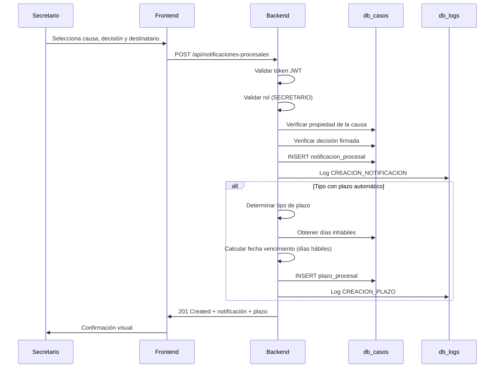
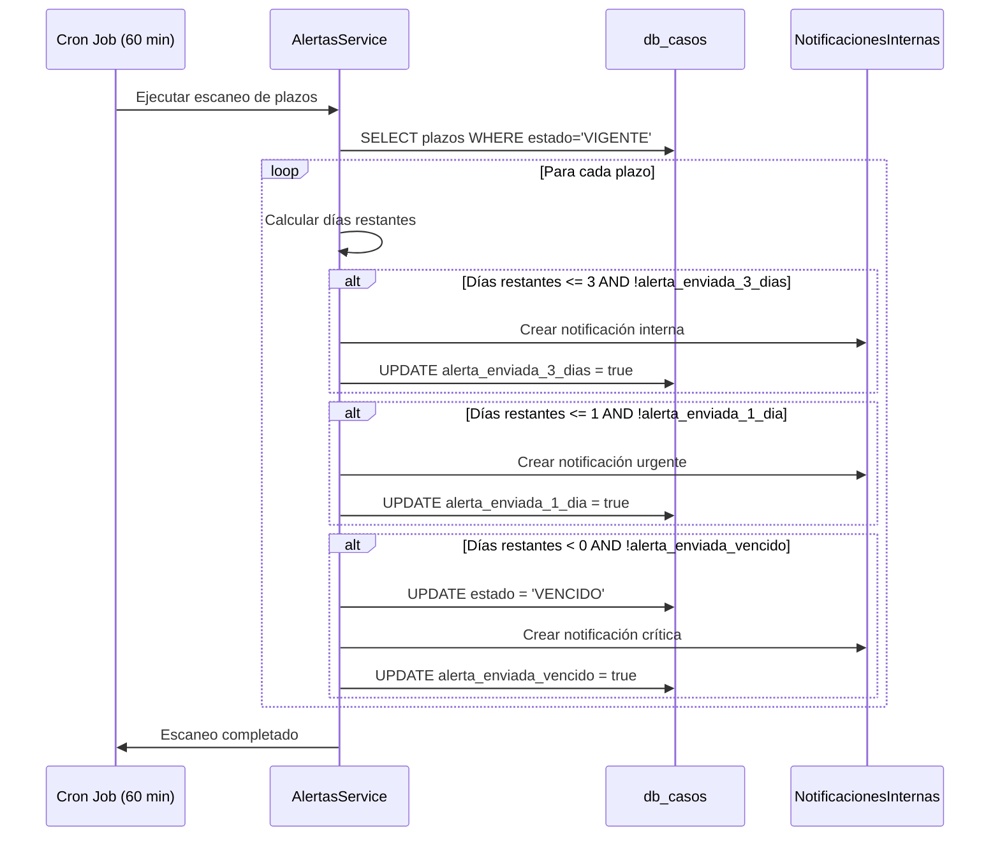

# HU-SJ-004: Notificaciones Procesales y Control de Plazos Judiciales

## 📋 Información General

| Campo | Valor |
|-------|-------|
| **ID** | HU-SJ-004 |
| **Nombre** | Notificaciones Procesales y Control de Plazos Judiciales |
| **Módulo** | Gestión de Notificaciones y Plazos |
| **Sprint** | Sprint 3 |
| **Estado** | ✅ Implementado |
| **Prioridad** | 🔴 CRÍTICA |
| **Fecha Implementación** | 2026-01-09 |

## 🎯 Objetivo

Permitir a los **Secretarios Judiciales** registrar notificaciones procesales vinculadas a decisiones judiciales firmadas, con **generación automática de plazos procesales** calculados en días hábiles, excluyendo fines de semana y feriados oficiales de Ecuador.

## 📖 Historia de Usuario

**Como** Secretario Judicial  
**Quiero** registrar notificaciones procesales y que el sistema genere automáticamente los plazos asociados  
**Para** asegurar el cumplimiento de los términos legales y mantener trazabilidad de las actuaciones judiciales

## 🔐 Requisitos de Seguridad

### 1. Control de Acceso por Rol (FDP_ACC)

#### Roles y Permisos

| Rol | Crear Notificación | Ver Notificaciones | Enviar | Ver Plazos | Marcar Cumplido |
|-----|-------------------|-------------------|--------|------------|-----------------|
| **SECRETARIO** | ✅ (solo sus causas) | ✅ (solo sus causas) | ✅ | ✅ | ✅ |
| **JUEZ** | ❌ | ✅ (solo sus causas) | ❌ | ✅ | ❌ |
| **ADMIN_CJ** | ✅ (todas) | ✅ (todas) | ✅ | ✅ | ✅ |

#### Validación de Propiedad
- ✅ Secretario solo crea notificaciones para causas que él gestiona
- ✅ Juez solo visualiza notificaciones y plazos de sus causas asignadas
- ✅ Verificación de `secretario_creador_id` o `juez_asignado_id` en cada operación

**Código de Validación**:
```typescript
// Verificar autorización sobre la causa
const verificacion = await casesPool.query(
  `SELECT causa_id FROM causas 
   WHERE causa_id = $1 
   AND (secretario_creador_id = $2 OR juez_asignado_id = $2)`,
  [causaId, usuario.funcionarioId]
);

if (verificacion.rows.length === 0) {
  throw new Error("No tiene autorización para crear notificaciones en esta causa");
}
```

### 2. Validación de Datos de Entrada

#### Esquema de Validación - Crear Notificación (Zod)
```typescript
const crearNotificacionSchema = z.object({
  causaId: z.number().int().positive(),
  decisionId: z.number().int().positive(), // OBLIGATORIO: No notificaciones huérfanas
  tipoNotificacion: z.enum([
    "citacion", "notificacion", "emplazamiento", "auto",
    "providencia", "sentencia", "recordatorio", "otro",
  ]),
  destinatarioTipo: z.enum([
    "actor", "demandado", "abogado_actor", "abogado_demandado",
    "tercero", "perito", "testigo",
  ]),
  destinatarioNombre: z.string().min(3).max(255),
  destinatarioIdentificacion: z.string().optional(),
  destinatarioCorreo: z.string().email().optional(),
  destinatarioDireccion: z.string().optional(),
  asunto: z.string().min(5).max(500),
  contenido: z.string().optional(),
  medioNotificacion: z.enum([
    "BUZON_ELECTRONICO", "CORREO_ELECTRONICO", "FISICO",
    "CASILLERO_JUDICIAL", "PUBLICACION", "DEPRECATORIO"
  ]),
});
```

#### Validaciones de Negocio
- ✅ La decisión debe existir y estar **firmada**
- ✅ La causa debe pertenecer al funcionario que crea la notificación
- ✅ El destinatario debe tener al menos nombre completo

### 3. Generación Automática de Plazos

Al crear una notificación, el sistema genera automáticamente un plazo procesal basado en el tipo de notificación:

| Tipo Notificación | Tipo Plazo Generado | Días Hábiles | Descripción |
|-------------------|---------------------|--------------|-------------|
| `citacion` | `comparecencia` | 3 | Comparecencia a audiencia |
| `emplazamiento` | `contestacion_demanda` | 15 | Contestación a la demanda |
| `auto` | `cumplimiento_auto` | 5 | Cumplimiento de auto |
| `providencia` | `cumplimiento_auto` | 5 | Cumplimiento de providencia |
| `sentencia` | `ejecucion_sentencia` | 5 | Ejecución de sentencia |
| `notificacion` | `subsanacion` | 3 | Subsanación de requisitos |
| `recordatorio` | - | - | Sin plazo automático |
| `otro` | - | - | Sin plazo automático |

**Código de Generación Automática**:
```typescript
// Mapeo de tipo de notificación a tipo_plazo válido para la BD
const mapeoNotificacionPlazo: Record<string, { tipoPlazo: string; dias: number; descripcion: string }> = {
  citacion: { tipoPlazo: "comparecencia", dias: 3, descripcion: "Comparecencia a audiencia" },
  emplazamiento: { tipoPlazo: "contestacion_demanda", dias: 15, descripcion: "Contestación a la demanda" },
  auto: { tipoPlazo: "cumplimiento_auto", dias: 5, descripcion: "Cumplimiento de auto" },
  providencia: { tipoPlazo: "cumplimiento_auto", dias: 5, descripcion: "Cumplimiento de providencia" },
  sentencia: { tipoPlazo: "ejecucion_sentencia", dias: 5, descripcion: "Ejecución de sentencia" },
  notificacion: { tipoPlazo: "subsanacion", dias: 3, descripcion: "Subsanación de requisitos" },
};

const plazoConfig = mapeoNotificacionPlazo[input.tipoNotificacion];

if (plazoConfig) {
  await plazosService.crearPlazo({
    causaId: input.causaId,
    notificacionId: notificacion.notificacionId,
    tipoPlazo: plazoConfig.tipoPlazo,
    descripcion: plazoConfig.descripcion,
    parteResponsable: input.destinatarioTipo === "actor" ? "actor" : 
                      input.destinatarioTipo === "demandado" ? "demandado" : undefined,
    diasPlazo: plazoConfig.dias,
  }, usuario, ipOrigen);
}
```

### 4. Motor de Cálculo de Días Hábiles

El sistema calcula la fecha de vencimiento de plazos considerando únicamente días hábiles:

#### Reglas de Exclusión
- ❌ **Sábados**: No se cuentan
- ❌ **Domingos**: No se cuentan
- ❌ **Feriados oficiales de Ecuador**: Cargados en tabla `dias_inhabiles`

#### Feriados Ecuador 2026 (Precargados)
```sql
INSERT INTO dias_inhabiles (fecha, descripcion, tipo) VALUES
    ('2026-01-01', 'Año Nuevo', 'feriado'),
    ('2026-02-16', 'Carnaval', 'feriado'),
    ('2026-02-17', 'Carnaval', 'feriado'),
    ('2026-04-03', 'Viernes Santo', 'feriado'),
    ('2026-05-01', 'Día del Trabajo', 'feriado'),
    ('2026-05-24', 'Batalla de Pichincha', 'feriado'),
    ('2026-08-10', 'Primer Grito de Independencia', 'feriado'),
    ('2026-10-09', 'Independencia de Guayaquil', 'feriado'),
    ('2026-11-02', 'Día de los Difuntos', 'feriado'),
    ('2026-11-03', 'Independencia de Cuenca', 'feriado'),
    ('2026-12-25', 'Navidad', 'feriado');
```

#### Algoritmo de Cálculo
```typescript
async calcularFechaVencimiento(
  fechaInicio: Date,
  diasHabiles: number
): Promise<CalculoVencimiento> {
  const diasInhabiles = await this.obtenerDiasInhabiles();
  let fechaActual = new Date(fechaInicio);
  let diasContados = 0;
  let diasSaltados = 0;

  while (diasContados < diasHabiles) {
    fechaActual.setDate(fechaActual.getDate() + 1);
    const resultado = await this.esDiaHabil(fechaActual, diasInhabiles);
    
    if (resultado.esHabil) {
      diasContados++;
    } else {
      diasSaltados++;
    }
  }

  return {
    fechaInicio,
    diasHabiles,
    fechaVencimiento: fechaActual,
    diasSaltados,
  };
}
```

### 5. Auditoría de Operaciones (FAU_GEN)

Todas las operaciones generan logs inmutables en `db_logs`:

| Operación | Tipo Evento | Módulo | Datos Registrados |
|-----------|-------------|--------|-------------------|
| Crear notificación | `CREACION_NOTIFICACION` | NOTIFICACIONES | causaId, decisionId, destinatario |
| Enviar notificación | `ENVIO_NOTIFICACION` | NOTIFICACIONES | notificacionId, medio, timestamp |
| Confirmar entrega | `CONFIRMACION_ENTREGA` | NOTIFICACIONES | notificacionId, evidencia |
| Crear plazo | `CREACION_PLAZO` | CASOS | plazoId, diasHabiles, fechaVencimiento |
| Actualizar estado plazo | `ACTUALIZACION_PLAZO` | CASOS | plazoId, estadoAnterior, estadoNuevo |

## 📊 Modelo de Datos

### Tabla: notificaciones_procesales
```sql
CREATE TABLE notificaciones_procesales (
    notificacion_id SERIAL PRIMARY KEY,
    
    -- Referencias obligatorias
    causa_id INTEGER NOT NULL REFERENCES causas(causa_id),
    decision_id INTEGER NOT NULL REFERENCES decisiones_judiciales(decision_id),
    
    -- Destinatario
    destinatario_tipo VARCHAR(50) NOT NULL,
    destinatario_nombre VARCHAR(255) NOT NULL,
    destinatario_identificacion VARCHAR(20),
    destinatario_correo VARCHAR(255),
    destinatario_direccion TEXT,
    destinatario_casillero VARCHAR(50),
    
    -- Contenido
    tipo_notificacion VARCHAR(50) NOT NULL,
    asunto VARCHAR(500) NOT NULL,
    contenido TEXT,
    medio VARCHAR(50) NOT NULL,
    
    -- Estado y seguimiento
    estado VARCHAR(30) NOT NULL DEFAULT 'PENDIENTE',
    fecha_creacion TIMESTAMPTZ NOT NULL DEFAULT NOW(),
    fecha_envio TIMESTAMPTZ,
    fecha_entrega TIMESTAMPTZ,
    fecha_lectura TIMESTAMPTZ,
    
    -- Auditoría
    creado_por_id INTEGER NOT NULL,
    enviado_por_id INTEGER,
    ip_origen INET,
    
    -- Constraints
    CONSTRAINT chk_destinatario_tipo CHECK (destinatario_tipo IN (
        'actor', 'demandado', 'abogado_actor', 'abogado_demandado',
        'tercero', 'perito', 'testigo', 'ministerio_publico', 'otro'
    )),
    CONSTRAINT chk_tipo_notificacion CHECK (tipo_notificacion IN (
        'citacion', 'notificacion', 'emplazamiento', 'auto',
        'providencia', 'sentencia', 'recordatorio', 'otro'
    )),
    CONSTRAINT chk_medio_notificacion CHECK (medio IN (
        'BUZON_ELECTRONICO', 'CORREO_ELECTRONICO', 'FISICO',
        'CASILLERO_JUDICIAL', 'PUBLICACION', 'DEPRECATORIO'
    )),
    CONSTRAINT chk_estado_notificacion CHECK (estado IN (
        'PENDIENTE', 'ENVIADA', 'RECIBIDA', 'LEIDA', 'FALLIDA', 'CANCELADA'
    ))
);
```

### Tabla: plazos_procesales
```sql
CREATE TABLE plazos_procesales (
    plazo_id SERIAL PRIMARY KEY,
    
    -- Referencias
    causa_id INTEGER NOT NULL REFERENCES causas(causa_id),
    notificacion_id INTEGER REFERENCES notificaciones_procesales(notificacion_id),
    decision_id INTEGER REFERENCES decisiones_judiciales(decision_id),
    
    -- Descripción del plazo
    tipo_plazo VARCHAR(100) NOT NULL,
    descripcion VARCHAR(500) NOT NULL,
    parte_responsable VARCHAR(50),
    
    -- Fechas del plazo
    fecha_inicio TIMESTAMPTZ NOT NULL,
    dias_plazo INTEGER NOT NULL,
    fecha_vencimiento TIMESTAMPTZ NOT NULL,
    
    -- Estado
    estado VARCHAR(30) NOT NULL DEFAULT 'VIGENTE',
    
    -- Alertas automáticas
    alerta_enviada_3_dias BOOLEAN DEFAULT FALSE,
    alerta_enviada_1_dia BOOLEAN DEFAULT FALSE,
    alerta_enviada_vencido BOOLEAN DEFAULT FALSE,
    
    -- Suspensión (si aplica)
    suspendido BOOLEAN DEFAULT FALSE,
    fecha_suspension TIMESTAMPTZ,
    fecha_reanudacion TIMESTAMPTZ,
    motivo_suspension TEXT,
    
    -- Cumplimiento
    cumplido BOOLEAN DEFAULT FALSE,
    fecha_cumplimiento TIMESTAMPTZ,
    observaciones_cumplimiento TEXT,
    
    -- Auditoría
    creado_por_id INTEGER NOT NULL,
    fecha_creacion TIMESTAMPTZ NOT NULL DEFAULT NOW(),
    
    -- Constraints
    CONSTRAINT chk_tipo_plazo CHECK (tipo_plazo IN (
        'contestacion_demanda', 'interposicion_recurso', 'cumplimiento_auto',
        'presentacion_pruebas', 'alegatos', 'apelacion', 'casacion',
        'ejecucion_sentencia', 'subsanacion', 'comparecencia', 'otro'
    )),
    CONSTRAINT chk_estado_plazo CHECK (estado IN (
        'VIGENTE', 'VENCIDO', 'CUMPLIDO', 'SUSPENDIDO', 'CANCELADO'
    )),
    CONSTRAINT chk_parte_responsable CHECK (parte_responsable IN (
        'actor', 'demandado', 'ambas_partes', 'juez', 'secretario', 'perito', 'otro'
    ))
);
```

### Tabla: dias_inhabiles
```sql
CREATE TABLE dias_inhabiles (
    dia_id SERIAL PRIMARY KEY,
    fecha DATE NOT NULL UNIQUE,
    descripcion VARCHAR(200),
    tipo VARCHAR(50) DEFAULT 'feriado',
    anio INTEGER GENERATED ALWAYS AS (EXTRACT(YEAR FROM fecha)) STORED,
    
    CONSTRAINT chk_tipo_dia CHECK (tipo IN ('feriado', 'suspension_judicial', 'vacacion_judicial', 'otro'))
);
```

## 🔄 Flujos de Operación

### Flujo 1: Crear Notificación con Plazo Automático


```mermaid
sequenceDiagram
    participant S as Secretario
    participant F as Frontend
    participant B as Backend
    participant DB as db_casos
    participant L as db_logs

    S->>F: Selecciona causa, decisión y destinatario
    F->>B: POST /api/notificaciones-procesales
    B->>B: Validar token JWT
    B->>B: Validar rol (SECRETARIO)
    B->>DB: Verificar propiedad de la causa
    B->>DB: Verificar decisión firmada
    B->>DB: INSERT notificacion_procesal
    B->>L: Log CREACION_NOTIFICACION
    
    alt Tipo con plazo automático
        B->>B: Determinar tipo de plazo
        B->>DB: Obtener días inhábiles
        B->>B: Calcular fecha vencimiento (días hábiles)
        B->>DB: INSERT plazo_procesal
        B->>L: Log CREACION_PLAZO
    end
    
    B->>F: 201 Created + notificación + plazo
    F->>S: Confirmación visual
```

### Flujo 2: Monitoreo de Plazos y Alertas


```mermaid
sequenceDiagram
    participant C as Cron Job (60 min)
    participant B as AlertasService
    participant DB as db_casos
    participant N as NotificacionesInternas

    C->>B: Ejecutar escaneo de plazos
    B->>DB: SELECT plazos WHERE estado='VIGENTE'
    
    loop Para cada plazo
        B->>B: Calcular días restantes
        
        alt Días restantes <= 3 AND !alerta_enviada_3_dias
            B->>N: Crear notificación interna
            B->>DB: UPDATE alerta_enviada_3_dias = true
        end
        
        alt Días restantes <= 1 AND !alerta_enviada_1_dia
            B->>N: Crear notificación urgente
            B->>DB: UPDATE alerta_enviada_1_dia = true
        end
        
        alt Días restantes < 0 AND !alerta_enviada_vencido
            B->>DB: UPDATE estado = 'VENCIDO'
            B->>N: Crear notificación crítica
            B->>DB: UPDATE alerta_enviada_vencido = true
        end
    end
    
    B->>C: Escaneo completado
```

## 📡 API Endpoints

### POST /api/notificaciones-procesales
Crea una nueva notificación procesal con plazo automático.

**Headers**:
```
Authorization: Bearer <jwt_token>
Content-Type: application/json
```

**Request Body**:
```json
{
  "causaId": 9,
  "decisionId": 5,
  "tipoNotificacion": "emplazamiento",
  "destinatarioTipo": "demandado",
  "destinatarioNombre": "Juan Carlos Pérez López",
  "destinatarioIdentificacion": "1712345678",
  "destinatarioCorreo": "jperez@email.com",
  "destinatarioDireccion": "Av. Amazonas N34-56, Quito",
  "asunto": "Emplazamiento - Contestación a la demanda",
  "contenido": "Se le notifica para que conteste la demanda en el plazo legal...",
  "medioNotificacion": "CORREO_ELECTRONICO"
}
```

**Response (201)**:
```json
{
  "success": true,
  "message": "Notificación creada exitosamente",
  "data": {
    "notificacionId": 12,
    "causaId": 9,
    "decisionId": 5,
    "tipoNotificacion": "emplazamiento",
    "destinatarioNombre": "Juan Carlos Pérez López",
    "estado": "PENDIENTE",
    "fechaCreacion": "2026-01-09T04:27:06.344Z"
  }
}
```

### GET /api/notificaciones-procesales/causa/:causaId
Lista notificaciones de una causa.

**Response (200)**:
```json
{
  "success": true,
  "data": [
    {
      "notificacionId": 12,
      "causaId": 9,
      "tipoNotificacion": "emplazamiento",
      "destinatarioNombre": "Juan Carlos Pérez López",
      "estado": "PENDIENTE",
      "medioNotificacion": "CORREO_ELECTRONICO",
      "fechaCreacion": "2026-01-09T04:27:06.344Z"
    }
  ],
  "total": 1
}
```

### GET /api/plazos/causa/:causaId
Lista plazos procesales de una causa.

**Response (200)**:
```json
{
  "success": true,
  "data": [
    {
      "plazoId": 2,
      "causaId": 9,
      "notificacionId": 12,
      "tipoPlazo": "contestacion_demanda",
      "descripcion": "Contestación a la demanda",
      "parteResponsable": "demandado",
      "diasPlazo": 15,
      "fechaInicio": "2026-01-09T04:27:06.344Z",
      "fechaVencimiento": "2026-01-30T04:27:06.344Z",
      "estado": "VIGENTE",
      "alertaEnviada3Dias": false,
      "alertaEnviada1Dia": false,
      "alertaEnviadaVencido": false
    }
  ],
  "total": 1
}
```

### PUT /api/plazos/:id/estado
Actualiza el estado de un plazo (marcar cumplido, suspender, etc.).

**Request Body**:
```json
{
  "nuevoEstado": "CUMPLIDO",
  "fechaCumplimiento": "2026-01-20T14:30:00.000Z",
  "observaciones": "Contestación presentada dentro del plazo"
}
```

### GET /api/plazos/alertas
Obtiene plazos próximos a vencer (para dashboard).

**Response (200)**:
```json
{
  "success": true,
  "data": [
    {
      "plazoId": 2,
      "causaId": 9,
      "numeroProceso": "17230-2026-00045",
      "tipoPlazo": "contestacion_demanda",
      "fechaVencimiento": "2026-01-30T04:27:06.344Z",
      "diasRestantes": 5,
      "nivelAlerta": "INFORMATIVO"
    }
  ]
}
```

## 🖥️ Interfaz de Usuario

### Página: Gestión de Notificaciones Procesales

**Ruta**: `/funcionario/notificaciones-procesales`

**Acceso**: 
- ✅ SECRETARIO (crear, ver, enviar)
- ✅ JUEZ (solo ver)

#### Componentes Principales

1. **Dashboard de Estadísticas**
   - Total de notificaciones
   - Pendientes de envío
   - Plazos vigentes
   - Plazos próximos a vencer

2. **Tabs de Navegación**
   - **Notificaciones**: Lista de notificaciones con filtros
   - **Plazos**: Control de plazos con indicadores visuales

3. **Modal de Creación de Notificación**
   - Selector de causa (auto-filtrado por usuario)
   - Selector de decisión firmada
   - Tipo de notificación (genera plazo automático)
   - Datos del destinatario (auto-llenado desde causa)
   - Medio de notificación
   - Asunto y contenido

4. **Vista de Plazos**
   - Indicador visual de urgencia (colores)
   - Badge de estado (VIGENTE, VENCIDO, CUMPLIDO)
   - Días restantes con formato condicional
   - Fecha de vencimiento

## 🔧 Archivos Implementados

### Backend

| Archivo | Propósito |
|---------|-----------|
| `src/routes/notificaciones-procesales.routes.ts` | Endpoints REST de notificaciones |
| `src/routes/plazos.routes.ts` | Endpoints REST de plazos |
| `src/services/notificaciones-procesales.service.ts` | Lógica de negocio de notificaciones |
| `src/services/plazos.service.ts` | Motor de cálculo de días hábiles y gestión de plazos |
| `src/services/alertas.service.ts` | Monitoreo automático de plazos |

### Frontend

| Archivo | Propósito |
|---------|-----------|
| `src/pages/funcionarios/GestionNotificacionesProcesales.tsx` | Página principal |
| `src/services/notificaciones-procesales.service.ts` | Cliente API notificaciones |
| `src/services/plazos.service.ts` | Cliente API plazos |

### Base de Datos

| Script | Propósito |
|--------|-----------|
| `scripts/casos_sprint3/01_init_sprint3.sql` | Tablas y catálogos |

## ✅ Criterios de Aceptación

| # | Criterio | Estado |
|---|----------|--------|
| 1 | Solo secretarios pueden crear notificaciones | ✅ Implementado |
| 2 | Notificaciones vinculadas a decisiones firmadas | ✅ Implementado |
| 3 | Plazo se genera automáticamente según tipo | ✅ Implementado |
| 4 | Cálculo de días hábiles excluye fines de semana | ✅ Implementado |
| 5 | Cálculo de días hábiles excluye feriados | ✅ Implementado |
| 6 | Jueces pueden visualizar notificaciones y plazos | ✅ Implementado |
| 7 | Alertas automáticas de plazos próximos a vencer | ✅ Implementado |
| 8 | Auditoría de todas las operaciones | ✅ Implementado |
| 9 | Auto-llenado de datos desde la causa | ✅ Implementado |

## 🧪 Pruebas Realizadas

### Prueba 1: Creación de Notificación con Plazo Automático
```
Entrada: Notificación tipo "sentencia" para causa 9
Resultado: 
  - Notificación creada con ID 11
  - Plazo "ejecucion_sentencia" creado automáticamente
  - 5 días hábiles calculados
  - Fecha vencimiento: 2026-01-16
```

### Prueba 2: Cálculo de Días Hábiles
```
Fecha inicio: 2026-01-09 (viernes)
Días hábiles: 5
Días saltados: 2 (sábado 10, domingo 11)
Fecha vencimiento: 2026-01-16 (viernes)
```

### Prueba 3: Visualización en Frontend
```
- Pestaña "Notificaciones" muestra lista filtrable
- Pestaña "Plazos" muestra plazos con indicadores de urgencia
- Dashboard muestra estadísticas correctas
```

## 📝 Notas de Implementación

1. **Timestamps UTC**: Todas las fechas se almacenan en UTC y se convierten al timezone local en el frontend.

2. **Transaccionalidad**: La creación de notificación y plazo se ejecutan en la misma transacción para garantizar consistencia.

3. **Monitoreo Automático**: El servicio de alertas escanea plazos cada 60 minutos para enviar notificaciones internas.

4. **Extensibilidad**: El catálogo de tipos de actuación permite agregar nuevos tipos de plazo sin modificar código.

---

**Documento generado**: 2026-01-09  
**Versión**: 1.0  
**Autor**: Sistema Juez Seguro
